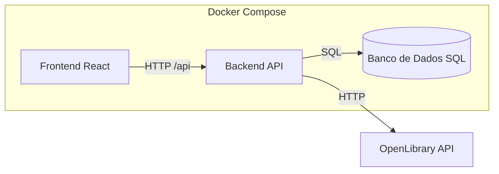

# Biblioteca Pessoal (Front-end)

Aplicação React + Vite para explorar livros da OpenLibrary, visualizar detalhes, marcar leituras e gerenciar notas pessoais. Interface animada com MUI, Framer Motion, Tailwind e React Query, consumindo o backend em `http://localhost:5000`.

## Visão geral
- Busca paginada na OpenLibrary com filtros por autor, título ou texto livre.
- Cache local em SQLite para minimizar chamadas externas e permitir paginação offline.
- Registro de leitura com nota opcional e consulta paginada dos livros lidos.
- API documentada via Swagger e pronta para execução local ou via Docker/Docker Compose.

## Arquitetura (fluxograma)


## Tecnologias principais
- React 19 + Vite + TypeScript
- MUI, Tailwind CSS, Framer Motion
- Axios + React Query
- React Router
- Zod para validação

## Pré-requisitos
- Node.js 22+ e npm
- Backend rodando em `http://localhost:5000` (endpoints `/books` e `/reads`)

## Instalação e execução local
1) Instalar dependências  
```bash
npm install
```

2) Rodar em desenvolvimento (porta 5173)  
```bash
npm run dev
```

3) Build de produção  
```bash
npm run build
```

4) Pré-visualizar build  
```bash
npm run preview
```

## Qualidade e testes
- Lint: `npm run lint`
- Testes (Vitest): `npm run test`

## API externa utilizada (OpenLibrary)
- Fonte: https://openlibrary.org/developers/api
- Licença: dados públicos (Open Data / Public Domain; ver termos no site), sem necessidade de chave de API.
- Cadastro: não requer cadastro nem token.
- Rotas utilizadas:
  - `GET /search.json` para busca (parâmetros `q`, `author`, `title`, `page`, `limit`).
  - `GET /works/{work_id}.json` para detalhes de uma obra específica.

## Docker
- Docker Front
```bash
docker build -t books-reads-frontend .
docker run -p 3000:3000 books-reads-frontend
```

- Docker Compose:
```bash
docker compose up -build
```
O volume `./instance` é montado para persistir o SQLite fora do container.